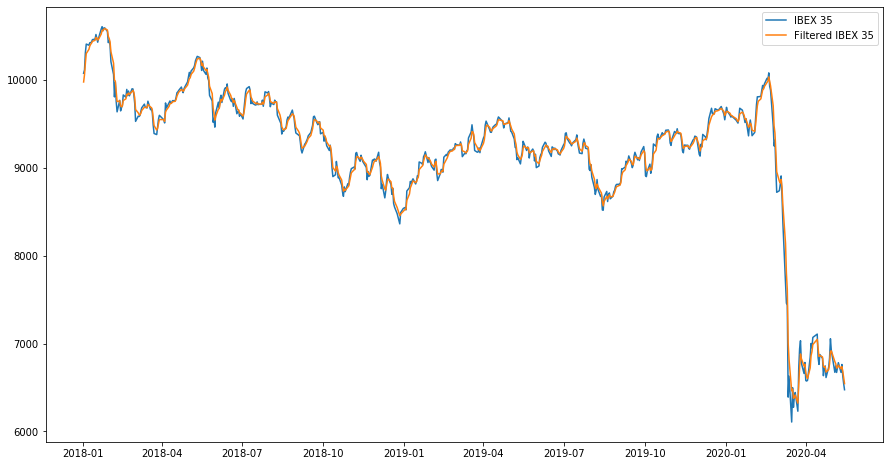

# Kalman Filter
A simple implementation of the Kalman filter algorithm using NumPy. To 
understand the notation used in the code, see the references and the end.

## Installation
Normal user:
```bash
git clone https://github.com/Xylambda/kalmanfilter.git
pip install kalmanfilter/.
```

alternatively:
```bash
git clone https://github.com/Xylambda/kalmanfilter.git
pip install kalmanfilter/. -r kalmanfilter/requirements-base.txt
```

Developer:
```bash
git clone https://github.com/Xylambda/kalmanfilter.git
pip install -e kalmanfilter/. -r kalmanfilter/requirements-dev.txt
```

## Tests
To run test, you must install the library as a `developer`.
```bash
cd kalmanfilter/
sh run_tests.sh
```

alternatively:
```bash
cd kalmanfilter/
pytest -v tests/
```

## Usage
To make use, you only need to decide the value of the different parameters.
Let's apply the Kalman filter to extract the signal of `Ibex 35` financial time
series. This series was obtained using [investpy](https://github.com/alvarobartt/investpy), 
but you will find the csv file in the examples folder.
```python
import numpy as np
import pandas as pd

from matplotlib import pyplot as plt
from kalmanfilter import kalman_filter
from pandas.plotting import register_matplotlib_converters


# set the parameters
Z = ibex['Close'].values
xk = 1
Pk = np.array([1])
A = np.array([1])
H = np.ones(len(Z))
Q = 0.005
R = 0.01

x, p = kalman_filter(Z, xk, Pk, A, H, Q, R)

register_matplotlib_converters()

plt.figure(figsize=(15,8))
plt.plot(ibex['Date'], ibex['Close'], label='IBEX 35')
plt.plot(ibex['Date'], x, label='Filtered IBEX 35')
plt.xticks(rotation=0);
plt.legend()
```


## References
* [1] Matlab - [Understanding Kalman Filters](https://www.youtube.com/playlist?list=PLn8PRpmsu08pzi6EMiYnR-076Mh-q3tWr)

* [2] Bilgin's Blog - [Kalman filter for dummies](http://bilgin.esme.org/BitsAndBytes/KalmanFilterforDummies)

* [3] Greg Welch, Gary Bishop - [An Introduction to the Kalman Filter](https://www.cs.unc.edu/~welch/media/pdf/kalman_intro.pdf)