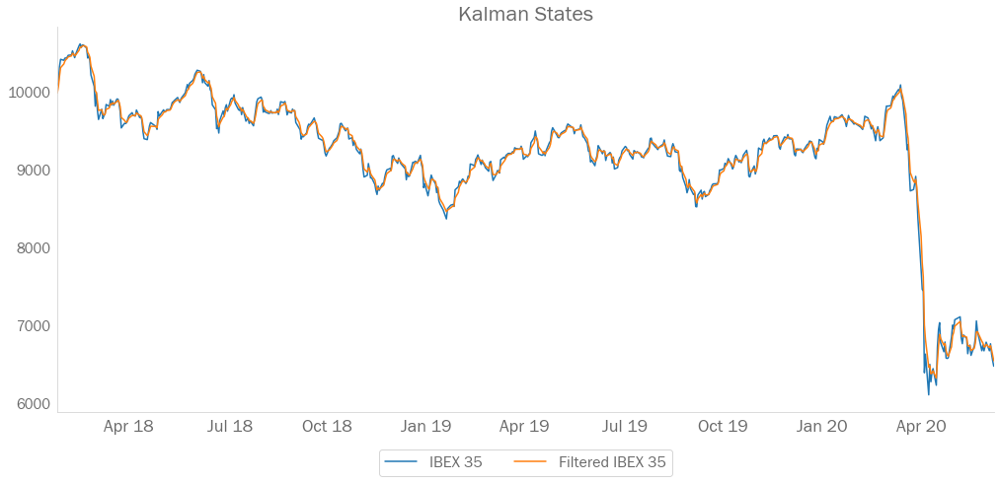

# Kalman Filter
A simple implementation of the Kalman filter algorithm using NumPy. The Kalman
filter is an optimal estimation algorithm, and it is optimal in the sense of 
reducing the expected squared error of the parameters.

The Kalman filter estimates a process by using a form of feedback control: time
update (predict) and measurement update (correct).

The prediction step:
<p align="center">
  
</p>

The update step:
<p align="center">
  
</p>

Notice how the Kalman gain regulates the weight between the prediction of the
hidden state and the real observation.

## Installation
Normal user:
```bash
git clone https://github.com/Xylambda/kalmanfilter.git
pip install kalmanfilter/.
```

alternatively:
```bash
git clone https://github.com/Xylambda/kalmanfilter.git
pip install kalmanfilter/. -r kalmanfilter/requirements-base.txt
```

Developer:
```bash
git clone https://github.com/Xylambda/kalmanfilter.git
pip install -e kalmanfilter/. -r kalmanfilter/requirements-dev.txt
```

## Tests
To run test, you must install the library as a `developer`.
```bash
cd kalmanfilter/
sh run_tests.sh
```

alternatively:
```bash
cd kalmanfilter/
pytest -v tests/
```

## Usage
To make use of the Kalman filter, you only need to decide the value of the 
different parameters. Let's apply the Kalman filter to extract the signal of 
`Ibex 35` financial time series. This series was obtained using 
[investpy](https://github.com/alvarobartt/investpy), but you will find the csv 
file in the examples folder.
```python
import numpy as np
import pandas as pd

from matplotlib import pyplot as plt
from kalmanfilter import kalman_filter
from pandas.plotting import register_matplotlib_converters

# read data
ibex = pd.read_csv('ibex35.csv')
ibex['Date'] = pd.to_datetime(ibex['Date'])


# set the parameters
Z = ibex['Close'].values
xk = 1
Pk = np.array([1])
A = np.array([1])
H = np.ones(len(Z))
Q = 0.005
R = 0.01

# apply kalman filter
x, p = kalman_filter(Z, xk, Pk, A, H, Q, R)

# plot results
register_matplotlib_converters()

plt.figure(figsize=(15,8))
plt.plot(ibex['Date'], ibex['Close'], label='IBEX 35')
plt.plot(ibex['Date'], x, label='Filtered IBEX 35')
plt.xticks(rotation=0);
plt.legend()
```


## References
* Matlab - [Understanding Kalman Filters](https://www.youtube.com/playlist?list=PLn8PRpmsu08pzi6EMiYnR-076Mh-q3tWr)

* Bilgin's Blog - [Kalman filter for dummies](http://bilgin.esme.org/BitsAndBytes/KalmanFilterforDummies)

* Greg Welch, Gary Bishop - [An Introduction to the Kalman Filter](https://www.cs.unc.edu/~welch/media/pdf/kalman_intro.pdf)
